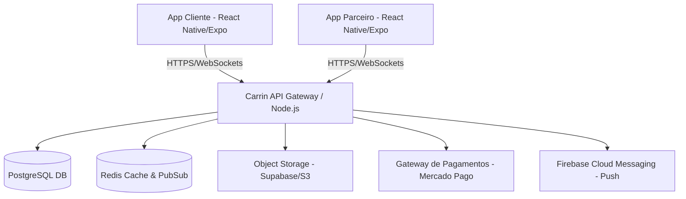
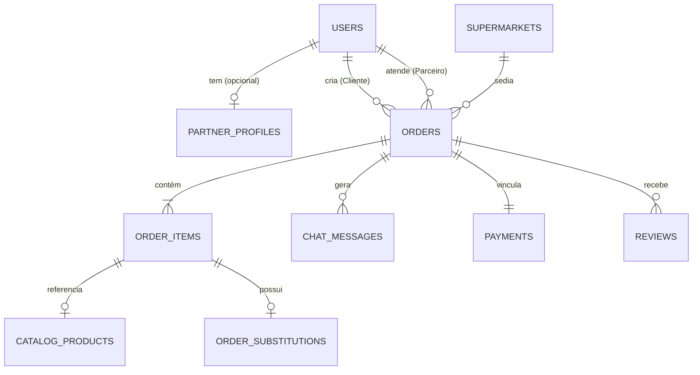
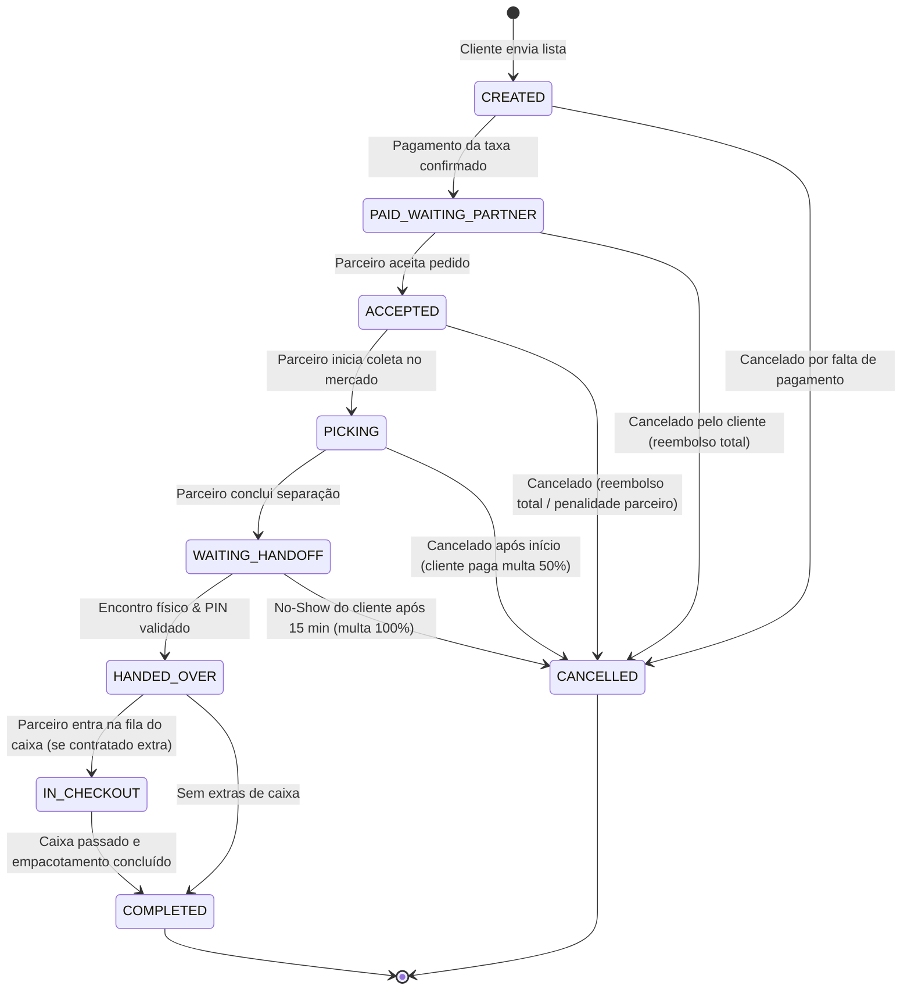

agy, leia o arquivo ARCHITECTURE.md e crie um arquivo schema.prisma inicial com todas as tabelas e relacionamentos definidos lá. Em seguida, liste os comandos que preciso rodar para iniciar o projeto Node.js com TypeScript e Prisma.# Carrin — Arquitetura de Software (ARCHITECTURE.md)

Este documento define a arquitetura técnica recomendada para o **Carrin**, incluindo o modelo de dados (entidades, atributos e relacionamentos), o ciclo de vida dos pedidos (máquina de estados de status) e a stack tecnológica proposta para viabilizar um MVP ágil e escalável.

---

## 1. Visão Geral da Arquitetura

O sistema é desenhado seguindo o modelo **API-First**, centrado em microsserviços ou um monolito modularizado no backend para o MVP, servindo a dois aplicativos móveis principais (Cliente e Parceiro).

---

## 2. Modelo de Dados (Relacional)

O banco de dados relacional (PostgreSQL) garante a integridade referencial e consistência transacional necessárias para as operações financeiras e fluxo de pedidos.

### 2.1. Entidades Principais e Atributos

#### Tabela: `users` (Clientes e Parceiros)
Armazena as informações comuns a todos os usuários da plataforma.
* `id`: UUID (Primary Key)
* `name`: VARCHAR(150)
* `email`: VARCHAR(150) (Unique)
* `password_hash`: VARCHAR(255)
* `phone`: VARCHAR(20) (Unique)
* `document_cpf`: VARCHAR(11) (Unique)
* `user_type`: ENUM('CLIENT', 'PARTNER', 'ADMIN')
* `avatar_url`: VARCHAR(255) (Nullable)
* `average_rating`: DECIMAL(3, 2) (Default: 5.00)
* `created_at`: TIMESTAMP
* `updated_at`: TIMESTAMP

#### Tabela: `partner_profiles` (Extensão para Pickers)
Contém dados específicos exigidos apenas dos parceiros de compras.
* `id`: UUID (Primary Key, FK -> `users.id`)
* `document_status`: ENUM('PENDING', 'APPROVED', 'REJECTED')
* `bank_agency`: VARCHAR(10)
* `bank_account`: VARCHAR(20)
* `pix_key`: VARCHAR(100)
* `is_available`: BOOLEAN (Default: FALSE)
* `current_latitude`: DECIMAL(9, 6) (Nullable)
* `current_longitude`: DECIMAL(9, 6) (Nullable)

#### Tabela: `supermarkets`
Cadastro dos supermercados físicos atendidos.
* `id`: UUID (Primary Key)
* `name`: VARCHAR(150)
* `address`: TEXT
* `latitude`: DECIMAL(9, 6)
* `longitude`: DECIMAL(9, 6)
* `is_active`: BOOLEAN (Default: TRUE)

#### Tabela: `catalog_products` (Catálogo Seeded)
Produtos pré-cadastrados para agilizar a criação de listas.
* `id`: UUID (Primary Key)
* `name`: VARCHAR(255)
* `barcode`: VARCHAR(50) (Unique, Nullable)
* `category`: VARCHAR(100)
* `suggested_price`: DECIMAL(10, 2) (Nullable)
* `image_url`: VARCHAR(255) (Nullable)

#### Tabela: `orders` (Pedidos)
Registra o estado geral do serviço de separação.
* `id`: UUID (Primary Key)
* `client_id`: UUID (FK -> `users.id`)
* `partner_id`: UUID (FK -> `users.id`, Nullable)
* `supermarket_id`: UUID (FK -> `supermarkets.id`)
* `status`: ENUM (Ver ciclo de vida na seção 3)
* `base_fee`: DECIMAL(10, 2)
* `services_fee`: DECIMAL(10, 2) (Soma dos adicionais contratados)
* `total_fee`: DECIMAL(10, 2) (base_fee + services_fee)
* `pincode`: VARCHAR(4) (Código de Handoff gerado na criação do pedido)
* `handoff_at`: TIMESTAMP (Nullable)
* `created_at`: TIMESTAMP
* `updated_at`: TIMESTAMP

#### Tabela: `order_items` (Itens do Pedido)
Itens específicos de uma lista de compras. Pode apontar para um produto do catálogo ou ser texto livre.
* `id`: UUID (Primary Key)
* `order_id`: UUID (FK -> `orders.id`)
* `catalog_product_id`: UUID (FK -> `catalog_products.id`, Nullable)
* `custom_name`: VARCHAR(255) (Caso o cliente adicione manualmente fora do catálogo)
* `quantity`: INTEGER (Default: 1)
* `unit_price`: DECIMAL(10, 2) (Preço final digitado pelo parceiro ao encontrar o produto)
* `barcode_matched`: BOOLEAN (TRUE se validado por código de barras, FALSE se por foto/manual)
* `photo_url`: VARCHAR(255) (Obrigatório se barcode_matched = FALSE e item não é do catálogo simples)
* `status`: ENUM('PENDING', 'FOUND', 'OUT_OF_STOCK', 'SUBSTITUTED', 'REMOVED') (Default: 'PENDING')
* `notes`: TEXT (Instruções do cliente, ex: "Trazer banana verde")

#### Tabela: `order_substitutions` (Propostas de Substituição)
Gerencia o histórico de ofertas de troca para produtos em falta.
* `id`: UUID (Primary Key)
* `order_item_id`: UUID (FK -> `order_items.id`)
* `proposed_name`: VARCHAR(255)
* `proposed_price`: DECIMAL(10, 2)
* `proposed_photo_url`: VARCHAR(255)
* `status`: ENUM('PENDING', 'APPROVED', 'REJECTED') (Default: 'PENDING')
* `created_at`: TIMESTAMP

---

## 3. Máquina de Estados do Pedido (Status Transitions)

O ciclo de vida do status do pedido segue uma sequência rígida para assegurar que o dinheiro em escrow (custódia) só seja movimentado e liberado após validações mútuas do processo físico.

### Detalhes das Transições Críticas
1. **`PAID_WAITING_PARTNER`**: O Pix foi recebido pelo gateway de pagamento e está retido na conta do Carrin. O pedido fica disponível para a listagem geográfica de parceiros próximos.
2. **`PICKING`**: O parceiro bloqueia a lista e começa a interagir com os itens. Qualquer alteração de status de item de `PENDING` para `FOUND`/`OUT_OF_STOCK` sincroniza em tempo real.
3. **`WAITING_HANDOFF`**: O parceiro terminou a lista física. O cliente visualiza a notificação e o PIN (ou QR Code) é liberado no seu painel. A tolerância de espera de 15 minutos do parceiro começa a contar.
4. **`HANDED_OVER`**: O parceiro insere o PIN correto do cliente no app. Isso encerra o tempo cronometrado do picking principal, garantindo proteção legal de que a mercadoria física foi repassada para as mãos do cliente.
5. **`COMPLETED`**: Estado final de sucesso. O gateway de pagamento é sinalizado para liberar a transferência dos 75% da taxa retida para a carteira virtual/Pix do parceiro.

---

## 4. Stack Tecnológica Recomendada (MVP & Escala)

Para garantir agilidade máxima de desenvolvimento (time-to-market) no MVP sem comprometer a capacidade de crescer de forma escalável na nuvem, a stack recomendada é dividida em camadas:

### 4.1. Camada Móvel (Frontend)
* **Tecnologia**: **React Native (com Expo)**
  - *Justificativa*: Desenvolvimento híbrido (iOS e Android com código único), permitindo reaproveitamento de 90%+ do código. Expo acelera o desenvolvimento de mapas, câmera (leitor de código de barras nativo rápido e otimizado), armazenamento offline (AsyncStorage/SQLite) e envio de builds de teste rápidos via OTA (Over-the-Air).

### 4.2. Camada de API e Lógica de Negócio (Backend)
* **Tecnologia**: **Node.js (TypeScript) com Fastify ou NestJS**
  - *Justificativa*: Processamento assíncrono extremamente rápido para chamadas de API, alta disponibilidade de bibliotecas para conexões em tempo real (WebSockets/Socket.io) e integração simples com serviços de push notification. O uso de TypeScript garante a tipagem estática e robustez do código.
* **ORM**: **Prisma ORM** (integração limpa e migrações ágeis com PostgreSQL).

### 4.3. Banco de Dados e Cache
* **Banco de Dados Principal**: **PostgreSQL**
  - *Justificativa*: Relacional, suporte a dados JSON (flexibilidade para customizações temporárias de itens), extensões espaciais (PostGIS para futuras buscas por geolocalização complexas de parceiros/mercados) e forte consistência transacional (ACID).
* **Camada de Cache e Real-time**: **Redis**
  - *Justificativa*: Usado para gerenciar sessões, guardar a localização atual dos parceiros ativos, controlar travas transacionais de aceitação de pedidos (Redis Locks) e atuar como Message Broker / PubSub leve para o chat em tempo real.

### 4.4. Infraestrutura e Serviços Terceirizados
* **Backend as a Service (MVP)**: **Supabase**
  - *Justificativa*: Acelera drasticamente a infraestrutura inicial do MVP fornecendo banco PostgreSQL hospedado, autenticação segura pronta, notificações em tempo real integradas (via PostgreSQL Replication triggers) e Object Storage para as fotos enviadas pelos parceiros. Reduz o tempo de setup do DevOps para zero no início do projeto.
* **Mensageria e Notificações**: **Firebase Cloud Messaging (FCM)**
  - *Justificativa*: Serviço padrão e gratuito da Google para gerenciar a entrega confiável de notificações Push de alta prioridade (essencial para alertar o cliente sobre substituições de produtos).
* **Processamento de Pagamento**: **Mercado Pago SDK**
  - *Justificativa*: Melhor suporte e menores taxas para Pix instantâneo e parcelamentos de cartão de crédito no mercado brasileiro, facilitando a retenção em escrow e posterior transferência via API (split de pagamento).
