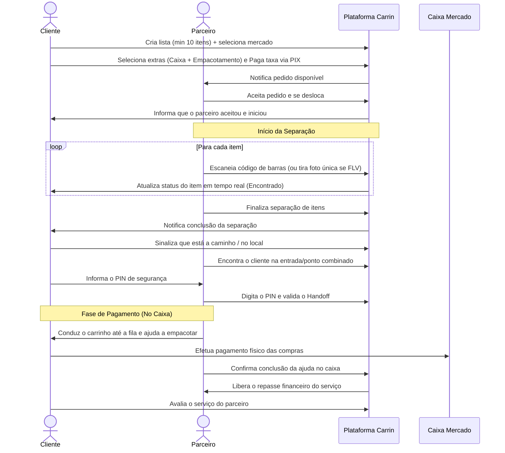

# Carrin — Especificação de Produto (PRODUCT_SPEC.md)

## 1. Visão Geral do Produto

O **Carrin** é uma plataforma mobile de separação assistida de compras em supermercados (personal picking) que conecta clientes ocupados a parceiros locais dispostos a prestar o serviço de coleta de itens no carrinho presencialmente. 

Diferente de aplicativos de entrega tradicionais (como Rappi ou iFood), o **Carrin não realiza o delivery e não processa o pagamento das compras no app**. O valor da compra de supermercado é pago pelo cliente diretamente no caixa física do estabelecimento. A plataforma intermedia exclusivamente a contratação do serviço de separação de compras (personal picking).

### Proposta de Valor
* **Para o Cliente**: Economia de tempo. O cliente só chega ao supermercado para conferir, passar no caixa e pagar, pulando a etapa exaustiva de circular pelos corredores procurando produtos.
* **Para o Parceiro**: Geração de renda extra flexível por meio de uma atividade de baixa barreira de entrada e sem necessidade de possuir veículo próprio para transporte de mercadorias.
* **Slogan**: *Seu carrinho pronto. Você só chega e paga.*

---

## 2. Direção e Critérios de Sucesso do MVP

O MVP (Minimum Viable Product) tem como objetivo principal validar três hipóteses críticas de negócio:
1. **Disposição a Pagar**: Clientes estão dispostos a pagar uma taxa de serviço justa para que alguém separe suas compras presenciais.
2. **Atração de Parceiros**: Parceiros aceitam fazer o serviço de separação se a remuneração por hora trabalhada for competitiva e compensar o esforço físico.
3. **Confiança e Segurança**: O fluxo de separação (com validações de itens por código de barras/foto) e o handoff no supermercado geram atrito mínimo e segurança contra fraudes.

---

## 3. Perfis e Personas

### 3.1. Cliente (Client)
* **Perfil**: Pessoas com rotina acelerada, famílias que realizam compras de abastecimento ("compra do mês"), idosos ou pessoas com mobilidade reduzida que preferem não caminhar pelo mercado.
* **Necessidade**: Agilidade, assertividade na escolha dos produtos (marcas e estados corretos dos itens) e previsibilidade.

### 3.2. Parceiro (Picker / Partner)
* **Perfil**: Trabalhadores autônomos, estudantes ou pessoas em busca de renda extra que residem ou transitam próximo a grandes supermercados.
* **Necessidade**: Aplicativo intuitivo, fluxo de separação rápido, remuneração justa pelo tempo gasto e segurança física/jurídica.

---

## 4. Regras de Negócio Detalhadas (Revisadas e Otimizadas)

### 4.1. Catálogo e Criação da Lista
* **Cadastro de Itens Simplicado**: Para o MVP, a plataforma utilizará um catálogo básico de itens comuns (ex: "Leite Integral 1L", "Arroz Tipo 1 5kg"), mas permitirá que o cliente adicione **Itens Personalizados** via descrição livre (ex: "Tomate italiano bem maduro - 1kg" ou "Sabão em pó Omo Lavagem Perfeita 1.6kg"). Isso contorna o problema de integração de estoques em tempo real com os supermercados.
* **Pedido Mínimo**: Fica estabelecido o mínimo de **10 itens** por pedido para justificar o deslocamento e o esforço do parceiro.

### 4.2. Estrutura Tarifária e Sustentabilidade Financeira (Modificada)
*Os valores originais (R$ 5 a R$ 13) eram impraticáveis para atrair e reter parceiros, pois o tempo médio de separação de 20-40 itens em mercado de grande porte é de 30 a 60 minutos.*

A nova estrutura de tarifas é calculada com base na quantidade de itens (tamanho do esforço) e garante uma remuneração atraente para o parceiro:

| Quantidade de Itens | Taxa Base ao Cliente | Remuneração Parceiro (75%) | Margem Carrin (25%) |
| :--- | :---: | :---: | :---: |
| **10 a 25 itens** | R$ 20,00 | R$ 15,00 | R$ 5,00 |
| **26 a 40 itens** | R$ 35,00 | R$ 26,25 | R$ 8,75 |
| **41 a 60 itens** | R$ 50,00 | R$ 37,50 | R$ 12,50 |
| **Acima de 60 itens** | R$ 50,00 + R$ 0,50 por item extra | 75% do total | 25% do total |

*Nota: As taxas de intermediação de pagamento (Gateway/Pix) são deduzidas da margem da plataforma Carrin.*

#### Serviços Adicionais (Opcionais)
* **Acompanhamento no Caixa / Fila**: **+ R$ 10,00** (75% repassado ao parceiro). O parceiro entra na fila convencional/rápida e aguarda o cliente chegar próximo à sua vez.
* **Empacotamento das Compras**: **+ R$ 5,00** (75% repassado ao parceiro). O parceiro ajuda a ensacar as compras no caixa enquanto o cliente realiza o pagamento.

### 4.3. Fluxo de Validação de Coleta (Otimizado)
*Substituição da obrigatoriedade de 2 fotos por item (produto + etiqueta de preço), o que geraria um gargalo operacional absurdo (ex: 80 uploads de fotos para um pedido de 40 itens).*

* **Validação por Código de Barras (Primária)**: O parceiro utiliza a câmera para escanear o código de barras do produto. Se coincidir com o cadastro, o item é marcado como "Encontrado".
* **Validação por Foto Única (Secundária/Falha)**: Se o produto não tiver código de barras (ex: FLV - frutas, legumes, verduras) ou se o código não for reconhecido, o parceiro deverá tirar **uma única foto** do item na gôndola/balança, mostrando o produto e a etiqueta de preço no mesmo enquadramento, inserindo o preço manualmente.

### 4.4. Regras de Substituição e Comunicação
* **Bloqueio da Lista**: Assim que o parceiro aceita o pedido, a lista original do cliente é congelada. Não é permitido adicionar novos itens sem consentimento do parceiro.
* **Fluxo de Falta de Estoque (Assíncrono)**:
  1. Se o item estiver em falta, o parceiro clica em "Item em Falta" e pode sugerir uma substituição (registrando foto do substituto e preço).
  2. O parceiro **não deve parar sua operação** esperando o cliente. Ele prossegue coletando os outros itens da lista.
  3. O cliente recebe uma notificação push de alta prioridade.
  4. O cliente tem **até a conclusão total da separação dos demais itens** pelo parceiro para tomar uma decisão (Aprovar substituto proposto, sugerir outro via chat ou remover o item).
  5. Ao finalizar a separação dos itens disponíveis, se ainda houver decisões pendentes de substituição, inicia-se um **cronômetro de tolerância final de 3 minutos**. Caso o cliente não responda neste período, os itens pendentes são automaticamente **removidos** da lista e o fluxo de separação é concluído.

### 4.5. Logística de Handoff (Encontro e Entrega do Carrinho)
*Correção crítica de segurança e viabilidade operacional: parceiros NÃO podem abandonar carrinhos em supermercados não parceiros.*

* **Proibição de Abandono de Carrinho**: Em supermercados comuns (sem parceria comercial com o Carrin), o parceiro **nunca** poderá deixar o carrinho cheio sem supervisão. Supermercados costumam recolher e desmontar carrinhos abandonados rapidamente por questões de organização e perecibilidade.
* **Coordenação de Chegada**: O cliente deve sinalizar pelo app quando estiver a caminho (distância/tempo estimado) e marcar "Cheguei ao Supermercado".
* **Código de Handoff Seguro (PIN)**: Para confirmar o encontro físico e evitar fraudes (um terceiro pegar o carrinho), o app do cliente gerará um **PIN de 4 dígitos** (ou QR Code). O parceiro deve digitar esse código em seu app para liberar o carrinho e finalizar seu tempo de serviço.
* **Grace Period (Tolerância de Espera)**:
  - O parceiro aguardará o cliente por até **15 minutos** após a finalização da coleta no ponto de encontro combinado (ex: entrada principal do mercado).
  - Durante esse período, o chat/ligação interna fica disponível.
  - Se o cliente não comparecer em 15 minutos, o parceiro é instruído a devolver o carrinho ao setor de atendimento/SAC do supermercado (ou cancelamento do pedido) e o cliente é penalizado financeiramente.

### 4.6. Política de Cancelamento e Reembolso

#### Cancelamento pelo Cliente
* **Até 2 minutos após o aceite do parceiro (antes do início da separação)**: Cancelamento gratuito.
* **Após o início da separação (parceiro no mercado)**: Multa de **50% da taxa base do serviço** (repassada integralmente ao parceiro como compensação pelo deslocamento).
* **Após a conclusão da separação ou em caso de No-Show (cliente não aparece após os 15 min de tolerância)**: Multa de **100% da taxa de serviço + adicionais contratados**. O parceiro recebe a remuneração integral dele.

#### Cancelamento pelo Parceiro
* **Antes de iniciar a separação**: Sem penalidade financeira imediata, mas o algoritmo reduz a taxa de aceitação e reputação do parceiro.
* **Após iniciar a separação**: Bloqueio temporário da conta para novos pedidos (24h) e análise pela moderação. Reincidência gera banimento. O cliente recebe reembolso de 100% da taxa de serviço paga.

---

## 5. Fluxos de Experiência Ponta a Ponta

### 5.1. Fluxo Principal (Happy Path com Acompanhamento de Caixa)

---

## 6. Mapeamento de Casos de Borda (Edge Cases) e Resoluções

### 6.1. O cliente atrasou e não chegou nos 15 minutos de tolerância
* **Fluxo**: Ao dar 15 minutos de espera, o app do parceiro libera o botão "Reportar Não-Comparecimento". O parceiro tira uma foto do carrinho com os produtos ao lado do balcão de informações/SAC do supermercado, deixando os produtos sob custódia dos funcionários do mercado (se aplicável) ou abandonando o processo de forma acordada com o SAC. O pedido é marcado como "Cancelado por No-Show". O cliente perde 100% da taxa paga, que é transferida integralmente ao parceiro.

### 6.2. O item coletado está danificado ou incorreto no momento da conferência física
* **Fluxo**: Na entrega do carrinho, o cliente pode conferir rapidamente os produtos sensíveis (hortifrúti, ovos, carnes). Caso encontre algo fora do padrão:
  - O parceiro pode realizar uma troca rápida no setor do mercado antes de passarem as compras no caixa (se houver boa vontade e tempo).
  - O cliente pode optar por remover o item da compra no próprio caixa físico antes de passar o código de barras, pagando apenas pelo que quer levar. A taxa de serviço do Carrin não sofre alteração por itens individuais removidos na hora do caixa por decisão do cliente, a menos que seja comprovado erro crasso ou má fé do parceiro (reportado na avaliação pós-pedido).

### 6.3. Falta de conexão de internet do parceiro dentro do supermercado
* **Fluxo**: O app mobile do parceiro deve possuir suporte a **modo offline resiliente**. Ele deve conseguir escanear códigos de barras e registrar fotos localmente no dispositivo. Ao recuperar a internet (ou ao se aproximar da entrada/saída onde o sinal é melhor), o app sincroniza em lote todas as ações pendentes com o servidor.

### 6.4. Falta de saldo/Limite do cliente para pagar no caixa
* **Fluxo**: Se o cliente chegar ao caixa e seu cartão for recusado ou ele não tiver dinheiro para pagar a compra física ao supermercado, isso **não é de responsabilidade do parceiro ou da plataforma Carrin**. O serviço de separação foi prestado. O handoff seguro com PIN já terá ocorrido antes do caixa. O cliente deve se resolver com o supermercado e a taxa do parceiro é repassada normalmente.

---

## 7. Registro de Alterações (Original vs. Revisado)

Esta seção documenta as principais alterações realizadas a partir do rascunho inicial do produto e as respectivas justificativas de negócio/técnicas:

1. **Alteração na Tabela de Preços (Seção 4.2)**:
   - *Original*: Taxas de R$ 5, R$ 8 e R$ 13.
   - *Modificado*: Taxas de R$ 20, R$ 35, R$ 50 + variáveis.
   - *Motivo*: Viabilidade operacional e atração de parceiros. R$ 3,50 (70% de R$ 5) não paga o esforço físico e o tempo de 30-45 minutos para separar uma compra pequena no mercado. Aumentando o ticket médio de serviço, a plataforma se torna atrativa e sustentável.
2. **Substituição das Duas Fotos Obrigatórias por Item (Seção 4.3)**:
   - *Original*: Tirar foto do produto e foto do preço para cada item.
   - *Modificado*: Validação primária por código de barras (leitura rápida via câmera) e foto única apenas para itens sem código (FLV) ou falhas de leitura.
   - *Motivo*: Performance e UX. Tirar e enviar 80 fotos em redes de internet instáveis de supermercados geraria travamentos no app, consumo excessivo de dados móveis e bateria, além de triplicar o tempo de picking do parceiro.
3. **Proibição de Carrinho Abandonado "Reservado" (Seção 4.5)**:
   - *Original*: Se o cliente não estiver presente, o parceiro sinaliza e deixa o carrinho "reservado" no mercado com uma placa.
   - *Modificado*: Totalmente proibido deixar carrinho cheio sem supervisão. Em caso de no-show após 15 minutos, o parceiro aciona o SAC do mercado e o pedido é cancelado por no-show do cliente.
   - *Motivo*: Risco de perda de mercadorias, desorganização física do supermercado e atrito severo com gerentes dos estabelecimentos, o que poderia inviabilizar o app judicial ou comercialmente.
4. **Introdução do PIN de Handoff Seguro (Seção 4.5)**:
   - *Original*: Não havia protocolo de segurança de entrega do carrinho.
   - *Modificado*: Fluxo de entrega protegido por PIN/QR Code fornecido pelo cliente.
   - *Motivo*: Segurança antifraude. Garante que o parceiro só entregue o carrinho à pessoa certa e comprova sistematicamente que o serviço de picking foi finalizado e entregue com sucesso, evitando disputas de estorno.
5. **Ajuste na Regra de Resposta de Substituição (Seção 4.4)**:
   - *Original*: Contradição entre tempo de tolerância até finalizar o pedido vs. 3 minutos para resposta sob pena de remoção imediata.
   - *Modificado*: O parceiro segue comprando outros itens; o cliente tem até o encerramento da separação total da lista para aprovar. Se o parceiro terminar tudo e restar pendência, inicia-se um cronômetro final unificado de 3 minutos.
   - *Motivo*: Aumento da produtividade do parceiro. Ele não fica de braços cruzados no meio do corredor esperando o cliente responder sobre o leite condensado.
